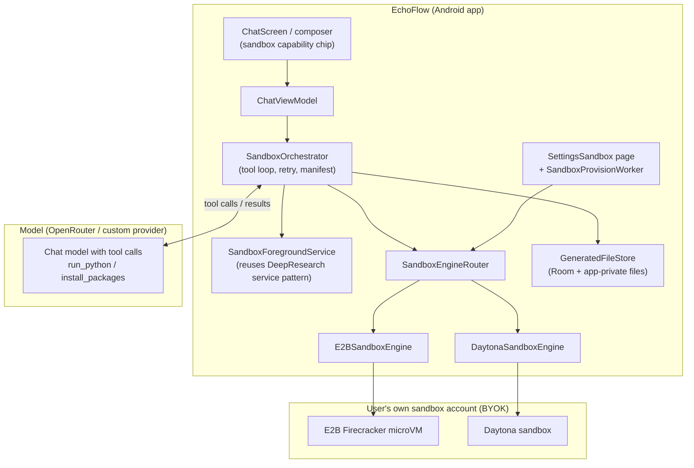
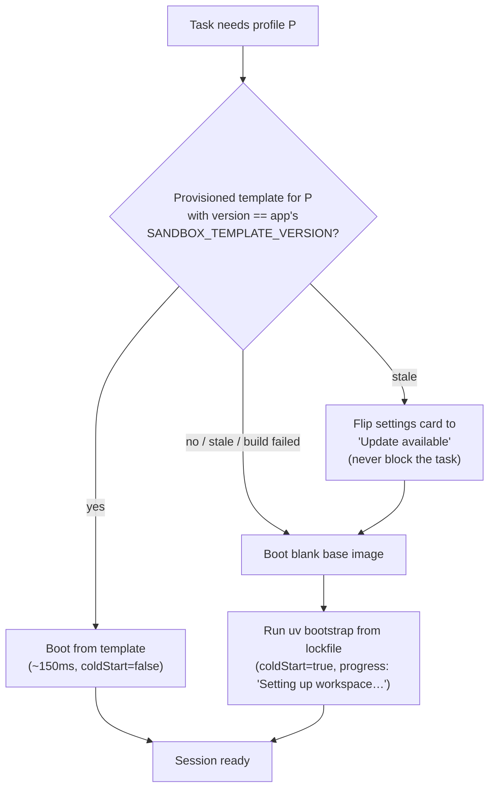
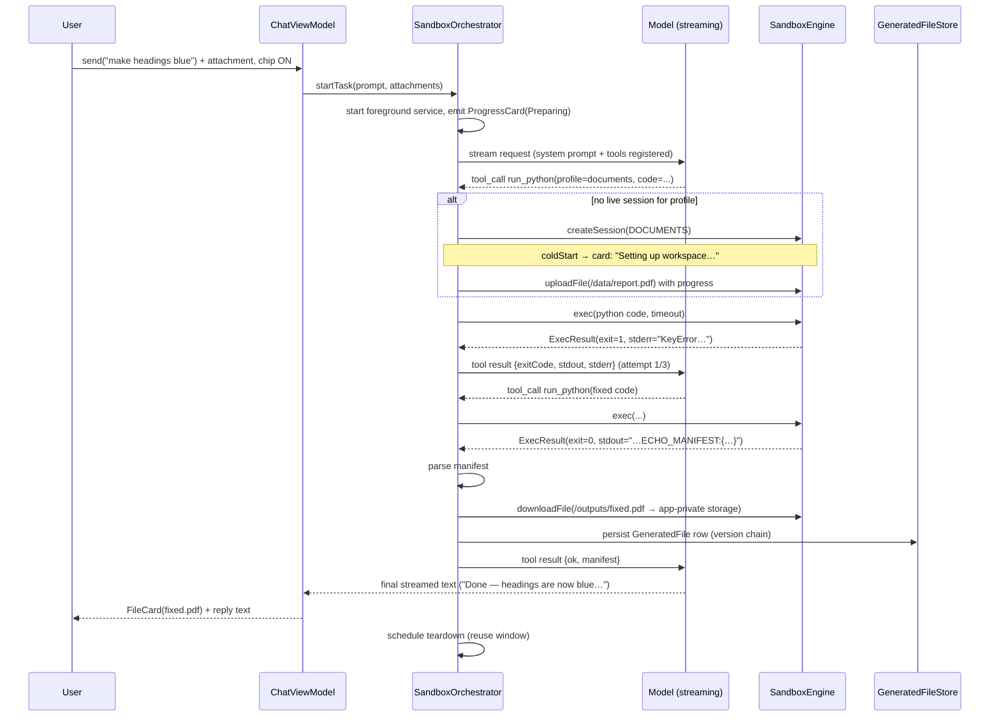
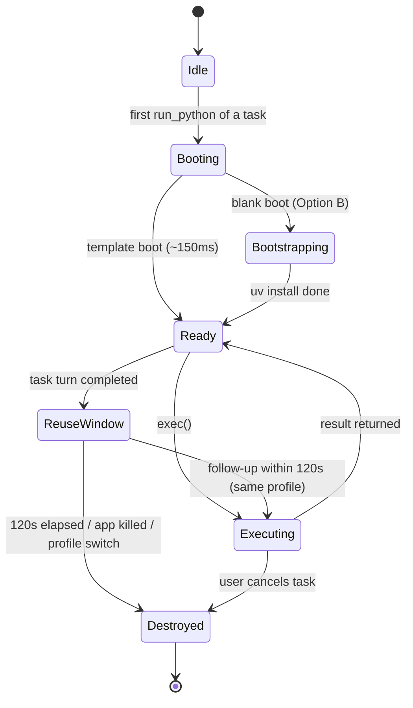
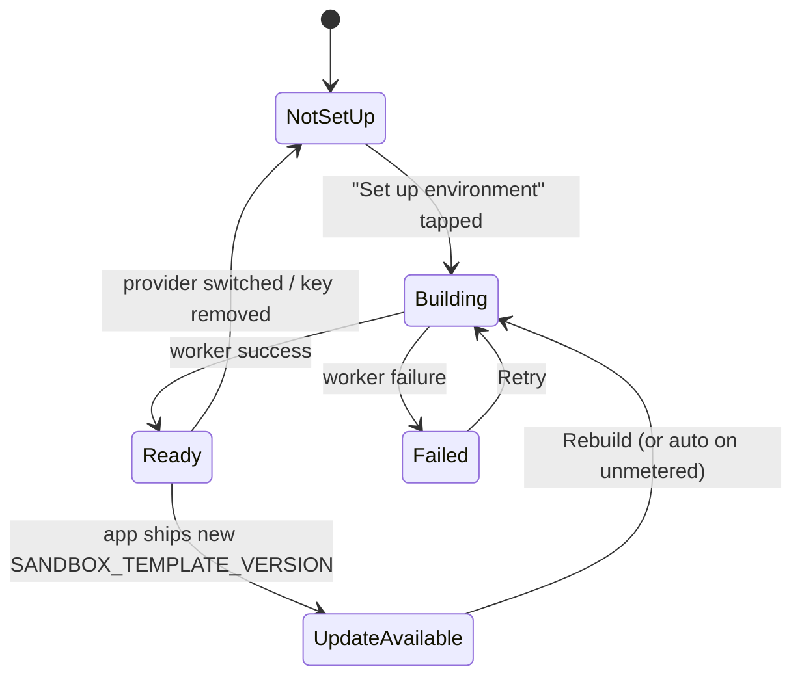
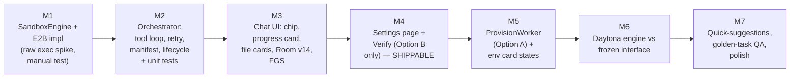

# EchoFlow Sandbox — Full Feature Specification

**Feature codename:** Echo Sandbox (user-facing name TBD — candidates: "File Agent", "Echo Sandbox")
**Version:** 1.0 spec · July 2026
**Target:** implementable end-to-end from this document alone.

---

## 1. What this feature is

The user attaches a file (PDF / CSV / XLSX / DOCX) or asks a data question in chat. The model writes
Python, which runs in a **cloud sandbox owned by the user** (their own E2B or Daytona account, BYOK —
consistent with EchoFlow's "no backend, no account, no telemetry" identity). Outputs come back as
**downloadable files** (fixed PDF, new spreadsheet, chart images, transcripts) rendered as cards in
the chat, with conversational iteration ("now make the headings green") producing new versions.

**What this feature is NOT:**

- Not a terminal. The user never sees a shell. No PTY, no file browser, no "workspace" page.
- Not on-device execution. No proot, no bundled Python. Zero APK weight, zero thermal cost.
  (Decision record: RikkaHub-style on-phone proot was evaluated and rejected — it ships the *means*
  (a shell) instead of the *ends* (a fixed file), and carries permanent maintenance/thermal/storage
  costs for a tiny user segment.)
- Not a place. It is a capability, like Web search or Create image: a chip in the `+` menu, results
  in the conversation.

**Product principles (apply to every decision below):**

1. **Outcome-first.** Every sub-feature must be nameable as a user outcome ("fix my PDF"), never a
   capability ("run code").
2. **Uniform regardless of engine.** The user experience is identical on E2B and Daytona (same
   philosophy as image gen: uniform dot-field animation regardless of model).
3. **BYOK cost honesty.** Session cost is always visible; sandboxes are killed aggressively.
4. **Provisioning never gates the feature.** The blank-boot bootstrap path always works; prebuilt
   templates are only an accelerator.
5. **Must work on mid-tier OpenRouter models,** not just frontier ones. This constrains the tool
   surface to be minimal.

---

## 2. Scope

### v1 (this spec)

| # | Feature | Description |
|---|---------|-------------|
| 1 | Document agent | Attach PDF/CSV/XLSX → describe change → get fixed/new file back |
| 2 | Data analysis & charts | Attach tabular file → ask questions → inline chart images + answers |
| 3 | SQL over files | DuckDB in the environment; prompt steers aggregation-heavy questions to SQL |
| 4 | File converter / PDF toolbox | Merge/split/compress/OCR PDFs, xlsx↔csv, images→PDF (prompt-only, no new code) |

### v1.x (same engine, later releases — listed so v1 architecture doesn't preclude them)

- Research report → designed PDF export (pipe Deep Research markdown through weasyprint)
- Slide decks (python-pptx)
- Audio transcription (faster-whisper, `media` profile)
- Batch image processing (needs multi-attachment support in the composer)
- Web → structured file (Firecrawl scrape → styled xlsx)

### Explicitly out of scope

- Video processing (upload sizes over mobile networks; revisit with size caps + Wi-Fi gating)
- Scheduled/recurring jobs
- Sandbox × Browser Flow fusion
- DOCX heavy editing / LibreOffice conversions (~700MB image cost; wait for demand signal)

---

## 3. Architecture overview



**Key structural decisions:**

- `SandboxEngineRouter` mirrors the existing `LocalImageGenerationEngineRouter` pattern exactly:
  one interface, two implementations, selection by settings.
- `SandboxOrchestrator` is a **new class in `data/`**, NOT more code in `ChatViewModel`. It owns the
  tool loop, retry policy, manifest parsing, and session lifecycle. `ChatViewModel` only toggles the
  chip, forwards the send, and observes progress state. (`ChatViewModel` is already 1,580 lines with
  a 14-DAO constructor — this feature must not widen it. See the refactor notes in project memory.)
- The foreground service reuses the shape of `DeepResearchForegroundService` (start on task begin,
  notification with progress, stop on completion) — a file job may take minutes and must survive
  the app being backgrounded.

---

## 4. The `SandboxEngine` interface

Freeze this against E2B first, then implement Daytona against the frozen interface.
**Do not develop both providers simultaneously** — the interface will wobble and every wobble costs
double.

```kotlin
/** One provider-agnostic cloud sandbox. All methods are suspend + IO-dispatched. */
interface SandboxEngine {
    /** Cheap authenticated call to validate the key (list templates / account info). */
    suspend fun verifyKey(): Result<SandboxAccountInfo>

    /**
     * Boot a sandbox for the given profile.
     * Implementation resolves: prebuilt template (if provisioned & version matches) else
     * blank boot + bootstrap script. Caller never knows which happened (except via
     * [SandboxSessionHandle.coldStart] for progress copy).
     */
    suspend fun createSession(profile: SandboxProfile): SandboxSessionHandle

    suspend fun uploadFile(
        session: SandboxSessionHandle,
        remotePath: String,          // always under /data/
        source: InputStream,
        sizeBytes: Long,
        onProgress: (Float) -> Unit,
    )

    /** Run a shell command or python snippet. Returns when done or timed out. */
    suspend fun exec(
        session: SandboxSessionHandle,
        command: String,
        timeoutMs: Long,
        stdin: ByteArray? = null,
    ): SandboxExecResult

    suspend fun listFiles(session: SandboxSessionHandle, dir: String): List<SandboxRemoteFile>

    suspend fun downloadFile(
        session: SandboxSessionHandle,
        remotePath: String,
        sink: OutputStream,
        onProgress: (Float) -> Unit,
    )

    suspend fun destroy(session: SandboxSessionHandle)
}

data class SandboxExecResult(
    val exitCode: Int,
    val stdout: String,      // truncate at 64 KB, note truncation
    val stderr: String,      // truncate at 16 KB
    val timedOut: Boolean,
)

enum class SandboxProfile { CORE, DOCUMENTS, MEDIA }

data class SandboxSessionHandle(
    val providerId: String,       // "e2b" | "daytona"
    val remoteSandboxId: String,
    val profile: SandboxProfile,
    val coldStart: Boolean,       // true = blank boot + bootstrap ran (slower; affects progress copy)
    val startedAtMs: Long,
)
```

**Provider notes:**

| | E2B | Daytona |
|---|-----|---------|
| Isolation | Firecracker microVM (own kernel) | Hardened OCI container |
| Boot | ~150 ms from template | 27–90 ms from snapshot |
| Custom env | **Template** built from Dockerfile-style definition, built on E2B infra, account-scoped | **Snapshot** from any OCI image, or captured from a configured running sandbox |
| Free tier | $100 one-time credit, no card | $200 credits |
| Session cap | 1 h (Hobby) / 24 h (Pro) | plan-dependent |

> **⚠ Verify at implementation time** (this market moves monthly):
> 1. E2B's current **programmatic** template-build path (historically CLI-first). If awkward from
>    the app, replicate Daytona's boot→bootstrap→snapshot pattern if E2B persistence allows.
> 2. Image-size / build-minute caps per plan on both providers — the settings page must warn, not
>    fail mysteriously.
> 3. Exact REST/SDK shapes for exec/upload/download on both.

---

## 5. Environments: profiles, bootstrap, templates

### 5.1 Profiles

Three immutable, versioned environments. The model selects one per task via tool parameter (§6).
**The model never chooses raw package lists** — fixed menu keeps environments tested and costs
bounded.

| Profile | Contents | Cold bootstrap target |
|---|---|---|
| `core` | python 3.12, **uv**, pandas, duckdb, matplotlib, openpyxl (read) | ≤ 15 s |
| `documents` | core + pypdf, pdfplumber, python-docx, openpyxl (write/styles), reportlab, weasyprint (+ fonts), ocrmypdf + tesseract | ≤ 40 s |
| `media` | ffmpeg, faster-whisper (small model weights) | ≤ 60 s |

### 5.2 Single source of truth

One **lockfile** (`sandbox/requirements-{profile}.lock`, exact pinned versions) shipped in app
assets drives BOTH paths:

- **Option B (bootstrap, always available):** blank provider image → `uv pip install -r <lockfile>`
  (uv, not pip — 10–20 s instead of 60–90 s). This is the permanent fallback.
- **Option A (prebuilt, accelerator):** the provisioning worker builds a template/snapshot in the
  *user's own account* from the same lockfile. E2B: submit Dockerfile referencing the lockfile.
  Daytona: boot blank → run the same bootstrap → snapshot the result. **One lockfile, two
  mechanisms, provably identical environments.**

Pin `SANDBOX_TEMPLATE_VERSION` (int) in the app. Template names are deterministic:
`echoflow-{profile}-v{N}` → provisioning is idempotent (check-before-create; a crashed worker rerun
finds the existing build instead of duplicating).

### 5.3 Environment resolution at session start



**Rule (non-negotiable):** a settings/provisioning failure must never make chat say "sandbox not
configured". Option A is an accelerator; Option B always works the moment a valid key exists.

---

## 6. Tool contract for the model

Minimal surface: **one primary tool + one bounded escape hatch.** No `start_sandbox` (lifecycle is
app policy, invisible to the model), no read/write/edit file tools (the model manipulates files
*through code* — that's the whole point).

### 6.1 Tools

```json
{
  "name": "run_python",
  "description": "Execute Python in the task workspace. Input files are at /data/. Write ALL outputs to /outputs/ and end by printing the manifest (see system instructions).",
  "parameters": {
    "profile":   { "type": "string", "enum": ["core", "documents", "media"], "default": "core" },
    "code":      { "type": "string" },
    "timeout_s": { "type": "integer", "default": 120, "maximum": 600 }
  }
}
```

```json
{
  "name": "install_packages",
  "description": "Install extra Python packages if the current environment lacks one. Only allow-listed packages are available.",
  "parameters": {
    "packages": { "type": "array", "items": { "type": "string" } }
  }
}
```

`install_packages` checks against a ~50-entry allowlist shipped in the app (Pillow, beautifulsoup4,
lxml, xlsxwriter, tabulate, chardet, python-dateutil, pytz, …). Rejection returns a message the
model can relay: `"Package X isn't supported in EchoFlow sandboxes yet."` Better a clear refusal
than a 3-minute wheel compile on the user's bill.

### 6.2 Wire-up

Tool calls ride the **existing streaming tool-call path** (the same transport Echo Agents uses with
auto `tool_choice` — see `CustomProviderToolStreamer` / OpenRouter tool plumbing). No new transport
work. The orchestrator registers the two tools only when the sandbox chip is active.

### 6.3 System prompt block (append when chip active — add to `SystemPrompts.kt`)

```
You have a sandboxed Python workspace for working with files and data.

Environments — pick via the `profile` parameter of run_python:
- core: pandas, duckdb, matplotlib — data questions, charts, CSV/simple xlsx (fastest start)
- documents: core + pypdf, pdfplumber, python-docx, openpyxl, reportlab, weasyprint, ocrmypdf —
  read, edit and create PDF, Word and Excel files
- media: ffmpeg, faster-whisper — audio conversion and transcription

Rules:
1. The user's attached files are at /data/ (exact paths are listed below).
2. Write every output file to /outputs/. Never write outputs anywhere else.
3. For aggregation-heavy questions over tabular files, prefer DuckDB SQL over pandas.
4. Charts: save as PNG to /outputs/ at 2x scale; do not call plt.show().
5. Your script MUST end by printing exactly one line:
   ECHO_MANIFEST:{"outputs":[{"path":"/outputs/<file>","description":"<short description>"}]}
   List every file you produced. If you produced none (answer-only task), print
   ECHO_MANIFEST:{"outputs":[]} and give the answer in your reply text.
6. If your code errors, you will receive stderr — fix the code and try again.

Attached files:
{{FILE_LIST}}   ← e.g. "/data/report.pdf (2.4 MB, application/pdf)"
```

### 6.4 The manifest convention

- Sentinel line `ECHO_MANIFEST:` followed by compact JSON, as the **last stdout line**.
- The app renders **only** files named in the manifest (prevents rendering scratch files).
- Parser: scan stdout lines from the end; first line starting with `ECHO_MANIFEST:` wins; strict
  JSON parse; on parse failure → treat as missing (see error matrix §10).
- This is the contract that keeps 12B-class models reliable: one convention, machine-checkable.

---

## 7. Orchestration

### 7.1 Task sequence



### 7.2 Retry policy

- Max **3** `run_python` attempts per task turn. Attempt counter shown on the progress card
  ("Working on it — attempt 2").
- stderr is fed back verbatim (truncated 16 KB). Do NOT auto-mutate the code app-side; the model
  fixes its own code.
- After attempt 3 fails: tool loop ends; orchestrator sends a final tool result
  `{failed: true, reason: "..."}` so the model can apologize with specifics; ErrorBanner shows a
  **Retry** action (re-runs the whole task — this is the retry-as-recovery pattern from the UX
  backlog).
- `install_packages` attempts don't count against the 3.

### 7.3 Session lifecycle



- **Reuse window: 120 s** after a turn completes, per profile. A follow-up ("now make them green")
  reuses the live session — inputs still at `/data/`, feels instant. This one decision is most of
  the perceived quality.
- **Profile switch = new sandbox.** Never mutate a running environment; profiles are immutable.
  (Both sessions may coexist during the window.)
- **Teardown is aggressive and reliable:** `destroy()` on window expiry, on task cancel, in
  `onCleared()`, and the foreground service's `onDestroy`. Both providers bill by liveness —
  leaked sandboxes are leaked user money. Also set the provider-side session TTL to a low value
  (e.g. 10 min) as a server-side backstop against app death.

### 7.4 Cancellation

Stop button during a sandbox task = cancel the exec (provider kill), destroy session, final card
state "Stopped". Same affordance position as the existing streaming Stop.

---

## 8. UI specification

### 8.1 Composer integration

- New entry in the `+` menu (`PlusMenu` in `ChatComposer.kt`): **"Sandbox"** with icon
  `Icons.Default.Terminal`-adjacent but friendlier (suggest `Icons.Default.Handyman` or
  `Icons.Default.AutoFixHigh`) — gated on a configured provider key
  (`sandboxAvailable`, same pattern as `browserFlowAvailable`).
- Active state renders a `CapabilityChip("Sandbox")` with remove action, like every other mode.
- Placeholder text when active: `"Attach a file & say what to do — or ask a data question…"`
- **Contextual quick-suggestions (discovery mechanism):** when a user attaches a PDF/CSV/XLSX and
  the chip is OFF but a key is configured, show up to 3 suggestion chips under the attachment
  preview: `Compress` · `Extract pages` · `Make searchable` (PDF) / `Clean up` · `Chart this` (CSV).
  Tapping one turns the chip on and prefills the prompt. This is how utility features get found.

### 8.2 Progress card (in-chat, styled like `ResearchProgressCard`)

States, in order, driven by orchestrator events:

1. `Preparing…`
2. `Setting up workspace…` (only when `coldStart` — with the expressive `LoadingIndicator`)
3. `Uploading your file… (43%)`
4. `Working on it…` / `Working on it — attempt 2`
5. `Collecting results…`
6. terminal: collapses into the file card(s) + reply, or error state with Retry.

Collapsible **"Show code"** section (like `ReasoningSection`): the last executed code, hidden by
default. Never show raw stderr to the user in the card; stderr is model-facing.

One-line cost/privacy strip on the card while a session is live (Browser Flow pattern):
`Runs in your E2B sandbox · billed by the minute while active · files deleted when the session ends`

### 8.3 File cards

- Per output file: type icon (PDF/XLSX/CSV/DOCX/PNG/other), filename, human size, and the
  manifest `description` as secondary text.
- Actions: **Save** (MediaStore → Downloads, toast/snackbar confirm), **Share** (share sheet),
  **Open** (ACTION_VIEW intent via FileProvider).
- PNG outputs (charts) render inline as images through the existing image message pipeline instead
  of a file card.
- **Version chain:** a follow-up that regenerates an output links `parentFileId` (same mental model
  as image gen versions). The card shows `v2` with access to previous versions.

### 8.4 Settings page — `SettingsSandbox.kt`

```
┌─ Sandbox ────────────────────────────────────┐
│ Provider          (● E2B     ○ Daytona)      │
│ API key           [••••••••••]   [Verify ✓]  │
│                                              │
│ ┌─ Environment ─────────────────────────┐    │
│ │ ● Ready · docs-v3 · built Jul 14      │    │
│ │ [Rebuild]                             │    │
│ └───────────────────────────────────────┘    │
│                                              │
│ Upload limit      [25 MB ▾]                  │
│                                              │
│ ⓘ Everything runs in your own account.       │
│   Sessions bill per minute while active.     │
│   Environment storage: ~a few ¢/month.       │
└──────────────────────────────────────────────┘
```

Environment card state machine:



- **Verify** = `engine.verifyKey()`; specific errors ("Invalid key" vs "Network error").
- Provider switch = clean slate for the new provider; previous provider's state is remembered if
  switched back. No migration.
- **Failed** state shows the tail of the provider build log (stored by the worker) + Retry.

### 8.5 Provisioning worker — `SandboxProvisionWorker`

Clone the `LocalImageModelDownloadWorker` pattern: WorkManager, foreground notification, survives
app death.

1. Check-before-create: does `echoflow-{profile}-v{N}` already exist in the account? → done.
2. E2B: submit build definition; Daytona: boot blank → run bootstrap → snapshot.
3. Poll status every ~5 s (builds run on provider infra; polling is cheap). Typical 2–5 min.
4. Success → persist `{providerId, templateIds per profile, version, builtAt}` in
   `SettingsRepository`. Failure → persist error + log tail.
5. Notification: `Building sandbox environment…` → `Sandbox environment ready`.
6. Build all three profiles sequentially in one worker run (core → documents → media); partial
   success is fine (resolution flow §5.3 falls back per-profile).

---

## 9. Data layer

Room bumps to **v14**. One new table (sessions are ephemeral — memory only; settings live in
`SettingsRepository` like every other provider key).

```kotlin
@Entity(tableName = "generated_files")
data class GeneratedFileEntity(
    @PrimaryKey val id: String,              // UUID
    val chatId: String,
    val messageId: String,
    val parentFileId: String?,               // version chain
    val fileName: String,
    val mimeType: String,
    val sizeBytes: Long,
    val localPath: String,                   // app-private: files/sandbox_outputs/{id}/{fileName}
    val description: String,                 // from manifest
    val profile: String,
    val providerId: String,
    val createdAt: Long,
)
```

- `GeneratedFileStore` mirrors `GeneratedImageStore`: Room rows + files under app-private storage.
  **Outputs are downloaded from the sandbox immediately on task completion** (sandboxes are
  ephemeral — never treat the sandbox as storage). "Save" copies to public Downloads via MediaStore.
- DAO: by message (card rendering), by chat, all (future "Generated files" gallery — same gallery
  the image feature will get), delete cascade with chat deletion (follow existing image-store
  cascade behavior).
- Migration v13→v14: create table only. Add a `DatabaseUpgradeTest` case (pattern exists).

---

## 10. Error handling matrix

| Failure | Detection | User-visible behavior |
|---|---|---|
| No provider key | chip gating | Chip hidden from `+` menu; suggestions hidden |
| Invalid key at task time | 401 from provider | ErrorBanner: "Your E2B key was rejected — check Settings → Sandbox" + link |
| Quota/credits exhausted | 402/429 | ErrorBanner: "Your E2B account is out of credits" |
| Boot failure | createSession throws | One silent retry, then ErrorBanner + Retry |
| Template stale/missing | version check | Silent fallback to bootstrap (§5.3); settings card flips to Update available |
| Upload too large | pre-check vs cap | Inline composer message: "File is 68 MB — limit is 25 MB" (blockedReason pattern) |
| Upload network failure | IO exception | One auto-retry, then ErrorBanner + Retry |
| Code fails ×3 | retry policy | Model apologizes with specifics; ErrorBanner Retry re-runs task |
| exec timeout | timedOut flag | Counts as a failed attempt; stderr substitute: "Execution timed out after Ns" |
| Manifest missing/corrupt | parser | One extra model turn: tool result `{error: "manifest missing — print ECHO_MANIFEST as your last line"}`; if still missing → fall back to listing `/outputs/` and render everything found, log divergence |
| Output download fails | IO exception | Retry ×2; then card shows file with "Download failed — Retry" state (session may still be in reuse window) |
| App killed mid-task | FGS restart | Foreground service pattern: task state is in-memory → task marked failed on restart with Retry (v1 accepts this; resumability is a v2 concern) |
| Sandbox leak | belt-and-braces | App-side destroy on all paths + provider-side TTL ≤ 10 min |

---

## 11. Security & privacy

- **Keys:** stored exactly like other provider keys (`SettingsRepository`, local only, never logged;
  do NOT log request bodies — maintain existing discipline).
- **User files:** transit only between the phone and the *user's own* sandbox account. State this
  in the settings page copy and the cost strip. Files in the sandbox die with the session.
- **Model-written code runs in the provider VM, not on the phone.** The app never executes model
  output locally. The manifest is parsed as strict data, never evaluated.
- **Downloaded outputs:** app-private storage; only user actions (Save/Share/Open) expose them, via
  FileProvider with per-file grants.
- **Size caps:** default 25 MB upload (settings-adjustable up to 100 MB), streaming upload with
  progress. Protects mobile data and the user's sandbox bill.
- **Allowlist for install_packages** (§6.1) bounds arbitrary-dependency execution and cost.

---

## 12. Testing plan

Follow the house style: plain JUnit in `app/src/test/`, characterization + contract tests.

| Test | Type |
|---|---|
| `ManifestParserTest` — sentinel found last-line, mid-noise, corrupt JSON, empty outputs, absent | unit |
| `BootstrapComposerTest` — profile → exact uv command from lockfile; pinned versions asserted | unit |
| `SandboxRetryPolicyTest` — 3-attempt cap, install_packages exemption, stderr passthrough truncation | unit |
| `SandboxSessionLifecycleTest` — reuse window hit/miss, profile switch = new session, teardown on cancel | unit (fake engine) |
| `SandboxToolSchemaTest` — tool JSON matches spec (schema snapshot) | characterization |
| `AllowlistTest` — accepted/rejected packages | unit |
| `GeneratedFileStoreTest` — persist/download/version chain/cascade (mirror `GeneratedImageStoreTest`) | unit |
| `DatabaseUpgradeTest` — v13→v14 | migration |
| `E2BEngineContractTest` / `DaytonaEngineContractTest` — real API behind env-var-gated flag (run manually with a dev key; CI skips) | contract |
| `SettingsSandboxStateTest` — environment card state machine transitions | unit |
| Manual QA script — the 10 golden tasks (below) on one frontier + one mid-tier (~12B) model | manual |

**Golden tasks** (must pass on both model tiers before ship): merge two PDFs · extract pages 2–4 ·
compress a PDF · OCR a scanned PDF · CSV → chart PNG · "top 5 by revenue" via DuckDB · xlsx → csv ·
csv → styled xlsx · add totals row to xlsx · follow-up edit reusing session ("make it green").

---

## 13. Implementation order



- **M4 is the first shippable cut** (E2B only, bootstrap only). Everything after improves it.
  If splitting releases: M4 = "beta" behind an Echo Labs toggle (existing gating pattern).
- Estimated relative effort: M1 ≈ M2 > M3 > M5 > M6 ≈ M4 > M7.

---

## 14. Copy reference (user-facing strings)

| Context | String |
|---|---|
| + menu | `Sandbox` |
| Chip | `Sandbox` |
| Placeholder | `Attach a file & say what to do — or ask a data question…` |
| Progress | `Preparing…` / `Setting up workspace…` / `Uploading your file…` / `Working on it…` / `Working on it — attempt 2` / `Collecting results…` |
| Cost strip | `Runs in your {provider} sandbox · billed by the minute while active · files deleted when the session ends` |
| Settings info | `Everything runs in your own account. EchoFlow never sees your files or your bill.` |
| Blocked (no key) | *(chip hidden — no string needed)* |
| Oversize | `This file is {size} — the sandbox upload limit is {cap}. You can raise it in Settings → Sandbox.` |

> **i18n note:** the app currently hardcodes strings. If the i18n refactor (see memory) lands
> first, these go to `strings.xml`; otherwise keep them centralized in one `SandboxStrings` object
> so extraction later is mechanical.

---

## 15. Open items (resolve during M1)

1. E2B programmatic template build path (§4 warning) — affects M5 only, not M1–M4.
2. Provider session TTL parameters — confirm both support server-side max-lifetime ≤ 10 min.
3. faster-whisper model weight strategy for `media` (bake into template vs download-on-first-use
   inside the sandbox) — decide by measuring template build size vs cold-start cost.
4. User-facing name: "Sandbox" is developer-flavored. Consider "File Agent" / "Echo Works".
   Decide before M3 (strings + icon).
5. Whether Echo Labs gating (master switch) applies at launch — recommended yes for one release,
   consistent with how Adviser/Fusion/Agents shipped.
